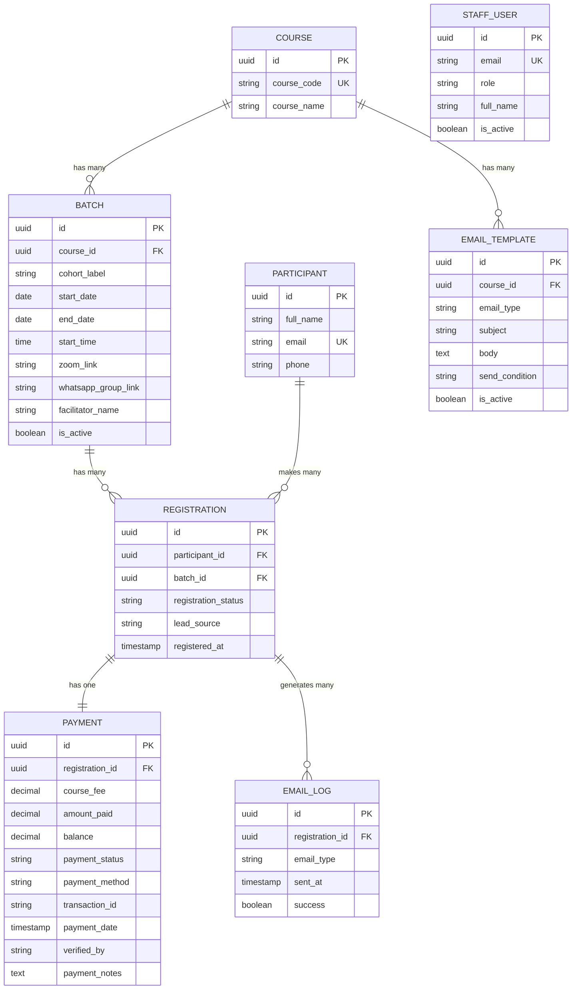

# Centralised Course Registration & Follow-Up System
## Product Requirements Document (PRD)

---

| Field | Value |
|---|---|
| **Document** | Product Requirements Document (PRD) |
| **Version** | 1.0 |
| **Date** | June 2026 |
| **Status** | Approved for Development |
| **Audience** | AI Coding Agent, Founder, All Staff |

---

## Changelog

| Version | Date | Change |
|---|---|---|
| 1.0 | June 2026 | Initial document — all Discovery stages complete |

---

## Table of Contents

1. [Product Overview](#1-product-overview)
2. [Problem Statement](#2-problem-statement)
3. [Ubiquitous Language Glossary](#3-ubiquitous-language-glossary)
4. [System Users and Roles](#4-system-users-and-roles)
5. [High-Level Entity Map](#5-high-level-entity-map)
6. [Feature Specification — Phase 1 (Must-Have)](#6-feature-specification--phase-1-must-have)
7. [Feature Specification — Phase 2 (Should-Have)](#7-feature-specification--phase-2-should-have)
8. [Feature Specification — Phase 3 (Could-Have)](#8-feature-specification--phase-3-could-have)
9. [Out of Scope](#9-out-of-scope)
10. [User Stories](#10-user-stories)
11. [Business Rules](#11-business-rules)
12. [Email Template System](#12-email-template-system)
13. [Success Metrics](#13-success-metrics)
14. [Compliance Requirements](#14-compliance-requirements)
15. [Non-Functional Requirements](#15-non-functional-requirements)
16. [Constraints and Assumptions](#16-constraints-and-assumptions)
17. [Ready for Development Checklist](#17-ready-for-development-checklist)

---

## 1. Product Overview

The Centralised Course Registration & Follow-Up System (hereafter **the System**) is an
internal web application that replaces a fragmented collection of Google Forms and Google
Sheets currently used to manage training course registrations, payments, and participant
communication.

The System is an internal operations tool. It is not a public product, learning management
system, or course marketplace. It manages the administrative and communication workflows that
happen before, during, and after a course intake — it does not deliver course content.

**The System is used by 6 internal staff members and interacts with external participants
via a registration form and automated email.**

---

## 2. Problem Statement

The business currently runs 4 training courses per month across 12 months (48 course intakes
per year) with an average of 30 participants per intake (1,440 participant registrations per
year). Each course has its own separate Google Form and Google Sheet. This produces five
operational failures:

| Failure | Current consequence |
|---|---|
| Data fragmentation | Registration, payment, and attendance data spread across 48+ separate sheets |
| Manual communication | Welcome emails, payment reminders, Zoom links, and WhatsApp invitations require manual effort per participant |
| Follow-up gaps | No system flags who needs a payment reminder, whose registration has gone cold, or who has not been invited to the WhatsApp group |
| No central visibility | No single view of registrations, payment status, expected revenue, or received revenue across all courses |
| No role-based access | Marketing staff, finance, tutors, and management have no dedicated views — all are working from the same unsegregated sheets |

---

## 3. Ubiquitous Language Glossary

**This glossary is authoritative. Every subsequent document in this documentation suite —
Technical Architecture, Data Schema, Business Logic, API Contract, and all others — uses
these terms exactly as defined here. No synonyms. No abbreviations unless listed.**

| Term | Definition |
|---|---|
| **Participant** | A person who has submitted the registration form for a course. A Participant exists in the System from the moment of registration, regardless of payment status. |
| **Lead** | A Participant whose Payment Status is Unpaid or Part Payment. A Lead has registered but not yet paid in full. |
| **Confirmed Participant** | A Participant whose Payment Status is Paid and whose Registration Status is Confirmed. A Confirmed Participant has a guaranteed place in the course. |
| **Course** | A training programme offered by the business. A Course has a unique Course Code and can have multiple Batches. |
| **Course Code** | A short unique identifier for a Course. Used as a primary key in the Course Settings and as a reference in Email Templates. Example: `ICAG-PREP`, `ACCA-F1`. |
| **Batch** | A specific intake of a Course. A Batch is one scheduled run of a Course, identified by the Course Code and the cohort label (e.g. `JAN-2026`, `BATCH-3`). All Participants in a Batch attend the same scheduled sessions. |
| **Cohort** | Synonym for Batch. Used interchangeably in staff communication. In the System, the field is labelled `Batch/Cohort`. |
| **Registration** | The act of a Participant submitting the registration form for a specific Batch of a Course. A Registration links one Participant to one Batch. |
| **Registration Status** | The current lifecycle stage of a Registration. Values: `Registered`, `Confirmed`, `Attended`, `Cancelled`. |
| **Payment Status** | The current payment state of a Registration. Values: `Unpaid`, `Part Payment`, `Paid`. |
| **Lead Source** | The marketing channel that brought a Participant to register. Values: `WhatsApp`, `Facebook`, `LinkedIn`, `Referral`, `Website`, `Other`. |
| **Course Fee** | The full amount a Participant is required to pay to become a Confirmed Participant. Defined per Course in the Course Settings. |
| **Amount Paid** | The total amount received from a Participant for a specific Registration. May be less than the Course Fee (Part Payment). |
| **Balance** | The outstanding amount owed by a Participant. Calculated as: `Course Fee − Amount Paid`. |
| **Payment Method** | The channel through which a Participant made a payment. Values: `Paystack Card`, `MTN MoMo`, `Bank Transfer`, `Cash`, `Other`. |
| **Transaction ID** | The unique reference for a payment. For Paystack payments: Paystack reference. For bank transfers: the bank transaction reference provided by the Participant. |
| **Verified By** | The Finance staff member who confirmed a bank transfer payment by cross-referencing the Transaction ID with the bank statement. |
| **Email Type** | The category of an automated email. Each Email Type has one Template per Course. See Section 12 for the full list. |
| **Send Condition** | The event or timing rule that triggers an Email Type to be sent. See Section 12. |
| **Email Log** | A record that an email of a specific Email Type was sent to a specific Participant for a specific Batch. Used to prevent duplicate sends. |
| **Active Course** | A Course with `Active/Inactive = Active` in Course Settings. Automations run only for Active Courses. |
| **Inactive Course** | A Course with `Active/Inactive = Inactive`. No automated emails or reminders are sent. |
| **Follow-Up** | A staff-initiated contact with a Lead to encourage payment. Tracked in the Follow-Up Tracker (Phase 2). |
| **Interest Level** | A staff assessment of a Lead's likelihood to pay. Values: `Hot`, `Warm`, `Cold`. |
| **Conversion** | The moment a Lead becomes a Confirmed Participant — i.e. Payment Status changes to Paid. |
| **Attendance** | A record that a Confirmed Participant was present at a course session. Tracked in Phase 2. |
| **Paystack Webhook** | An HTTP POST request sent by Paystack to the System when a payment event occurs. Used to auto-confirm card and MoMo payments. |
| **Dashboard** | The management summary view showing per-course and aggregate registration and payment data. |
| **Role** | The access level assigned to a Staff User. Determines which views and actions are available. Values: `admin`, `finance`, `marketing`, `tutor`, `management`. |

---

## 4. System Users and Roles

The System has 6 Staff Users and one external actor (Participant) who interacts via the
registration form and email only.

### 4.1 Staff Users

| Role | Count | Default landing page | Can read | Can write | Cannot access |
|---|---|---|---|---|---|
| **admin** | 1 | Dashboard | Everything | Everything | Nothing |
| **finance** | 1 | Payment Tracking | Registrations (read), Payments (all), Courses (read) | Payment status, Amount paid, Verified by, Payment notes | Follow-up tracker, Email templates |
| **marketing** | 2 | Registration list | Registrations (all), Lead source data, Payment status (read only) | Follow-up notes (Phase 2), Interest level (Phase 2) | Payment write, User management, Course settings |
| **tutor** | 1 | My Courses | Confirmed Participants only, for their assigned course only | Attendance (Phase 2) | Unpaid participant data, Payment data, Other tutors' courses |
| **management** | 1 | Dashboard | Dashboard and reports (read only) | Nothing | Individual participant records, Payment details |

### 4.2 External Actor: Participant

A Participant is not a Staff User and does not have a login account. A Participant
interacts with the System through:

- The public registration form (submit registration)
- Automated emails (receive information, links, and reminders)

Participants cannot log in, view their own record, or modify any data.

---

## 5. High-Level Entity Map



> The detailed schema with all column types, constraints, indexes, Row Level Security
> policies, and migration scripts is in Document 3: Data Schema and ERD.

---

## 6. Feature Specification — Phase 1 (Must-Have)

Phase 1 must be complete within 5 weeks and operational before the next course intake.
No Phase 1 feature may be removed or deferred without the founder's explicit approval.

---

### F1.01 — Registration Intake Form

**Description:** A public-facing web form that replaces all existing Google Forms. Participants
submit one form regardless of which course they are registering for.

**Fields:**

| Field | Type | Required | Validation |
|---|---|---|---|
| Full Name | Text | Yes | Minimum 2 characters |
| Email | Email | Yes | Valid email format; stored lowercase |
| Phone Number | Text | Yes | Must include country code; Ghana numbers: +233 format |
| Course Name | Dropdown | Yes | Populated from Active Courses in Course Settings |
| Batch/Cohort | Dropdown | Yes | Populated by available Batches for the selected Course |
| Registration Source | Dropdown | Yes | Values: WhatsApp, Facebook, LinkedIn, Referral, Website, Other |
| Ghana DPA Consent | Checkbox | Yes | Must be checked to submit. Text: "I consent to my personal data being collected and used to manage my course registration and communicate with me about this course and related programmes. I understand I may request access to or deletion of my data at any time." |

**Behaviour on submit:**
1. System creates a Participant record (or matches existing by email address).
2. System creates a Registration record linked to the Participant and the selected Batch.
3. System creates a Payment record with Amount Paid = 0, Balance = Course Fee, Payment Status = Unpaid.
4. System triggers the Welcome Email (F1.06) and the Payment Instruction Email (F1.06).
5. Participant sees a confirmation message: "Thank you, [Full Name]. Your registration for [Course Name] has been received. Please check your email for payment instructions."
6. Form does not redirect. Confirmation message replaces the form on the same page.

**Duplicate handling:**
If a Participant (matched by email) already has a Registration for the same Batch, the form
submission is rejected with the message: "You are already registered for this course intake.
If you need help, please contact us." No duplicate Registration is created.

---

### F1.02 — Course Control Panel

**Description:** An admin-only interface for creating and managing Courses and Batches.
All email automation depends on data entered here.

**Course fields:**

| Field | Type | Required | Notes |
|---|---|---|---|
| Course Code | Text | Yes | Unique identifier; uppercase; no spaces; example: `ICAG-PREP` |
| Course Name | Text | Yes | Full display name shown to Participants on the registration form |

**Batch fields:**

| Field | Type | Required | Notes |
|---|---|---|---|
| Batch/Cohort Label | Text | Yes | Example: `JAN-2026`, `BATCH-3` |
| Course Fee | Decimal | Yes | The amount Participants are required to pay. In GHS. |
| Start Date | Date | Yes | Used to calculate payment reminder timing |
| Start Time | Time | Yes | Used in email content |
| End Date | Date | Yes | Used to trigger post-training emails (Phase 2) |
| Zoom Link | URL | Yes | Inserted into Zoom Link Email (Phase 2); available in email templates |
| WhatsApp Group Link | URL | Yes | Inserted into WhatsApp Invite Email (Phase 2); available in email templates |
| Facilitator Name | Text | Yes | Inserted into email templates |
| Welcome Email | Toggle | Yes | On / Off — enable or disable the welcome email for this Batch |
| Payment Reminder | Toggle | Yes | On / Off — enable or disable payment reminders for this Batch |
| Class Reminder | Toggle | Yes | On / Off — enable or disable class reminders for this Batch (Phase 2) |
| Active/Inactive | Toggle | Yes | Active = automation runs; Inactive = no emails sent |

**Access:** Admin only. Finance, Marketing, Tutor, and Management roles can read Course and
Batch data but cannot create, edit, or delete.

---

### F1.03 — Participant Registration List

**Description:** A staff-facing view of all Registrations, filterable and searchable.

**Columns displayed:**

| Column | Notes |
|---|---|
| Registration Timestamp | Date and time of form submission |
| Full Name | |
| Email | |
| Phone Number | |
| Course Name | |
| Course Code | |
| Batch/Cohort | |
| Registration Source | Lead Source value |
| Registration Status | Registered / Confirmed / Attended / Cancelled |
| Payment Status | Unpaid / Part Payment / Paid |
| Notes | Free-text field editable by Admin and Marketing |

**Filters available:** Course Name, Batch/Cohort, Registration Status, Payment Status,
Registration Source, Date range (registration timestamp).

**Search:** By Full Name, Email, or Phone Number.

**Role visibility:**
- Admin: All columns, all courses, all batches.
- Finance: All columns, read only (writes are on the Payment Tracking screen).
- Marketing: All columns except Payment Notes. All courses and batches.
- Tutor: Confirmed Participants only. Their assigned course and batch only. No payment data.
- Management: Dashboard only — this screen is not visible to the Management role.

---

### F1.04 — Payment Tracking Interface

**Description:** The primary Finance staff screen. Shows payment records for all Registrations
with tools to update payment status and record verification.

**Columns displayed:**

| Column | Editable by Finance | Notes |
|---|---|---|
| Full Name | No | |
| Phone Number | No | |
| Email | No | |
| Course Name | No | |
| Batch/Cohort | No | |
| Course Fee | No | Set in Course Settings |
| Amount Paid | Yes | Finance enters the amount received |
| Balance | No | Auto-calculated: Course Fee − Amount Paid |
| Payment Status | Yes | Unpaid / Part Payment / Paid |
| Payment Method | Yes | Paystack Card / MTN MoMo / Bank Transfer / Cash / Other |
| Transaction ID | Yes | Reference number entered by Finance for manual payments |
| Payment Date | Yes | Date payment was received |
| Verified By | Auto-fill | Automatically set to the logged-in Finance user's name when payment is marked as Paid |
| Payment Notes | Yes | Free text for Finance |

**Filters available:** Course Name, Batch/Cohort, Payment Status, Payment Method, Date range.

**Behaviour when Finance marks a payment as Paid:**
1. Payment Status updates to Paid.
2. Balance auto-calculates to 0 (or remaining if partial).
3. Registration Status automatically updates to Confirmed.
4. Payment Confirmation Email triggers immediately.
5. All pending payment reminders for this Participant and Batch are cancelled.
6. Verified By field auto-fills with the current Finance user's name.

---

### F1.05 — Paystack Webhook Handler

**Description:** A server-side API endpoint that receives and processes payment confirmation
events from Paystack. Handles both card and MTN MoMo payments made through Paystack.

**Endpoint:** `POST /api/webhooks/paystack`

**Behaviour:**
1. Receive the webhook payload from Paystack.
2. Validate the `x-paystack-signature` header against the Paystack secret key. If invalid,
   return HTTP 401 and discard. Do not process.
3. Check the Paystack reference against the Payment table. If already processed (idempotency
   check), return HTTP 200 and stop. Do not process again.
4. If the event is `charge.success`:
   a. Find the Registration matching the Paystack reference.
   b. Update Amount Paid = amount from webhook payload (in GHS — divide kobo value by 100).
   c. Recalculate Balance.
   d. If Balance = 0: set Payment Status = Paid, Registration Status = Confirmed.
   e. If Balance > 0: set Payment Status = Part Payment.
   f. Record Transaction ID = Paystack reference.
   g. Record Payment Method = `Paystack Card` or `MTN MoMo` based on webhook `channel` field.
   h. Trigger Payment Confirmation Email if Payment Status = Paid.
   i. Cancel all pending payment reminders if Payment Status = Paid.
5. Return HTTP 200 to Paystack in all cases where the webhook was validly received
   (including idempotency skips).

**Security:** The Paystack secret key is stored as a Vercel environment variable. It is
never hardcoded in source code or committed to version control.

---

### F1.06 — Automated Email System

**Description:** The engine that sends all automated emails. Emails are triggered by system
events and time-based rules. All emails are sent via Resend.

**Architecture:**
- Email templates are stored in the Email Template table, one per Course per Email Type.
- Templates use placeholders that are replaced with live data at send time.
- Before sending any email, the system checks the Email Log table. If a record exists for
  the same Registration ID + Email Type, the email is not sent (deduplication).
- All sent emails are recorded in the Email Log with timestamp and success status.

**Available email placeholders:**

| Placeholder | Replaced with |
|---|---|
| `{{participant_name}}` | Participant's Full Name |
| `{{course_name}}` | Course Name |
| `{{course_code}}` | Course Code |
| `{{batch_cohort}}` | Batch/Cohort label |
| `{{course_fee}}` | Course Fee in GHS |
| `{{amount_paid}}` | Amount Paid in GHS |
| `{{balance}}` | Outstanding Balance in GHS |
| `{{start_date}}` | Course Start Date (formatted: Monday, 14 July 2026) |
| `{{start_time}}` | Course Start Time (formatted: 9:00 AM) |
| `{{zoom_link}}` | Zoom Link from Batch settings |
| `{{whatsapp_group_link}}` | WhatsApp Group Link from Batch settings |
| `{{facilitator_name}}` | Facilitator Name from Batch settings |
| `{{payment_method}}` | Payment Method used (for confirmation emails) |
| `{{transaction_id}}` | Transaction ID (for confirmation emails) |
| `{{payment_date}}` | Date payment was received (for confirmation emails) |

---

### F1.07 — Phase 1 Automated Email Types

#### E01 — Welcome Email

| Property | Value |
|---|---|
| Send Condition | On Registration (immediately after form submission) |
| Target | All new Registrations |
| Gate | `active_course = true` AND `welcome_email_enabled = true` for the Batch |
| Deduplication key | Registration ID + `welcome` |

#### E02 — Payment Instruction Email

| Property | Value |
|---|---|
| Send Condition | On Registration (immediately after form submission, concurrent with E01) |
| Target | All new Registrations |
| Gate | `active_course = true` |
| Required content | Must include all payment methods accepted (Paystack link, bank account details, MoMo number), exact Course Fee in GHS, and explicit instruction: "After making a bank transfer, send your transaction reference number to [contact] so we can confirm your payment." |
| Deduplication key | Registration ID + `payment_instruction` |

#### E03 — Payment Reminder 1

| Property | Value |
|---|---|
| Send Condition | Immediately after Registration (runs with E01 and E02 if Payment Status = Unpaid — which it always is at Registration) |
| Target | Registrations where Payment Status = Unpaid |
| Gate | `active_course = true` AND `payment_reminder_enabled = true` |
| Deduplication key | Registration ID + `reminder_1` |
| Note | Reminder 1 is effectively the same trigger as E02. Implementors may combine E02 and E03 into one email if the content is identical, or send as two separate emails. The PRD treats them as separate Email Types. |

#### E04 — Payment Reminder 2

| Property | Value |
|---|---|
| Send Condition | 24 hours after Registration timestamp, if Payment Status is still Unpaid |
| Target | Registrations where Payment Status = Unpaid AND registered_at < NOW() − 24 hours |
| Gate | `active_course = true` AND `payment_reminder_enabled = true` |
| Deduplication key | Registration ID + `reminder_2` |

#### E05 — Payment Reminder 3

| Property | Value |
|---|---|
| Send Condition | When the current date is 2 days before Batch Start Date, if Payment Status is Unpaid or Part Payment |
| Target | Registrations where Payment Status IN (Unpaid, Part Payment) AND Batch Start Date = TODAY + 2 days |
| Gate | `active_course = true` AND `payment_reminder_enabled = true` |
| Deduplication key | Registration ID + `reminder_3` |

#### E06 — Payment Reminder 4

| Property | Value |
|---|---|
| Send Condition | On the morning of Batch Start Date (run at 07:00 Ghana time), if Payment Status is Unpaid or Part Payment |
| Target | Registrations where Payment Status IN (Unpaid, Part Payment) AND Batch Start Date = TODAY |
| Gate | `active_course = true` AND `payment_reminder_enabled = true` |
| Deduplication key | Registration ID + `reminder_4` |

#### E07 — Payment Confirmation Email

| Property | Value |
|---|---|
| Send Condition | When Payment Status changes to Paid (triggered by Paystack webhook or Finance manual update) |
| Target | The Registration whose Payment Status just changed to Paid |
| Gate | `active_course = true` |
| Required content | Must confirm participant's place, state the amount received, include the Transaction ID, and state the course start date and time. |
| Deduplication key | Registration ID + `payment_confirmation` |
| Side effect | All pending reminder emails (reminder_2, reminder_3, reminder_4) for this Registration are cancelled. If the Email Log already shows a reminder as sent, it cannot be unsent — cancellation applies only to reminders not yet sent. |

---

### F1.08 — Management Dashboard

**Description:** A read-only summary view of all course performance data. Visible to Admin
and Management roles. The default landing page for the Management role.

**Per-Course Card (one card per active Batch):**

| Metric | Calculation |
|---|---|
| Course Name + Batch Label | Display |
| Start Date | Display |
| Total Registered | COUNT of Registrations for this Batch |
| Total Paid (Confirmed) | COUNT of Registrations where Payment Status = Paid |
| Total Unpaid | COUNT of Registrations where Payment Status = Unpaid |
| Total Part Payment | COUNT of Registrations where Payment Status = Part Payment |
| Expected Revenue | SUM of Course Fee × Total Registered |
| Revenue Received | SUM of Amount Paid across all Registrations for this Batch |
| Outstanding Balance | Expected Revenue − Revenue Received |
| Payment Conversion Rate | (Total Paid ÷ Total Registered) × 100, displayed as a percentage |

**Aggregate Summary (across all active Batches):**

| Metric | Calculation |
|---|---|
| Total Registrations This Month | COUNT of Registrations where registered_at is in current calendar month |
| Total Revenue Received This Month | SUM of Amount Paid where payment_date is in current calendar month |
| Total Outstanding Balance | SUM of Balance across all active Batches |

**Lead Source Summary (current month):**

| Column | Notes |
|---|---|
| Registration Source | WhatsApp / Facebook / LinkedIn / Referral / Website / Other |
| Count | Number of registrations from this source this month |
| Conversion Rate | % of registrations from this source that have paid |

---

### F1.09 — Role-Based Access Control

**Description:** All data access is enforced at the database level using Supabase Row Level
Security (RLS) policies. Application-level role checks are a secondary guard only.

**RLS policies required:**

| Table | admin | finance | marketing | tutor | management |
|---|---|---|---|---|---|
| courses | CRUD | R | R | R | R |
| batches | CRUD | R | R | R (own batch only) | R |
| participants | CRUD | R | R | R (confirmed in own batch) | — |
| registrations | CRUD | R | R | R (confirmed, own batch) | — |
| payments | CRUD | CRUD | R (status only) | — | — |
| email_log | R | — | — | — | — |
| email_templates | CRUD | — | — | — | — |
| staff_users | CRUD | — | — | — | — |

> R = Read only. CRUD = Create, Read, Update, Delete. — = No access.

**Tutor-specific RLS rule:** A Tutor can only read Registrations where:
- `payment_status = 'paid'` (Confirmed Participants only), AND
- The Batch is assigned to that Tutor (matched by `facilitator_name` = Tutor's name, or
  by a direct batch assignment relationship — see Data Schema document for implementation).

---

### F1.10 — Ghana DPA Compliance Features

**Description:** Two features required by the Ghana Data Protection Act 2012 that must ship
in Phase 1.

**DPA-01 — Consent at Registration:**
The registration form includes a mandatory consent checkbox (see F1.01). The form cannot be
submitted without checking this box. The consent text is non-editable by staff. The fact that
consent was given is recorded as a boolean field on the Registration record with the timestamp
of consent.

**DPA-02 — Participant Data Deletion:**
Admin users can initiate deletion of a Participant's personal data in response to a data
subject erasure request. The deletion process is two-step:

Step 1 — Soft delete (immediate):
- Participant record is flagged as `deleted_at = NOW()`.
- The Participant's data is hidden from all staff views.
- Registrations and Payment records are retained for financial audit purposes, but the
  Participant's name, email, and phone are anonymised to `[DELETED]`.

Step 2 — Hard delete (manual, Admin only, 30 days after soft delete):
- All remaining personally identifiable fields are permanently removed.
- A deletion log entry is created recording the date of deletion and the Admin who performed
  it (for audit purposes).

This two-step process satisfies the DPA right to erasure while preserving financial records
for compliance purposes.

---

## 7. Feature Specification — Phase 2 (Should-Have)

Phase 2 begins after Phase 1 is stable and in production. Target: weeks 6–9.

| ID | Feature | Description |
|---|---|---|
| F2.01 | Class Reminder Email (24h) | Sent 24 hours before Batch Start Date to all Confirmed Participants. Includes Zoom link and start time. |
| F2.02 | Class Reminder Email (2h) | Sent 2 hours before Batch Start Time to all Confirmed Participants. |
| F2.03 | Zoom Link Distribution Email | Sent to Participant when Payment Status changes to Paid. Includes Zoom link, start date, start time, and facilitator name. |
| F2.04 | WhatsApp Group Invitation Email | Sent to Participant when Payment Status changes to Paid. Includes WhatsApp group link and instructions for joining. |
| F2.05 | Post-Training Thank You Email | Sent the day after Batch End Date to all Participants with Registration Status = Attended. |
| F2.06 | Upsell / Cross-Sell Email | Sent 3 days after Batch End Date to all Attended Participants. Recommends a related course. Template must allow the Admin to specify the recommended course. |
| F2.07 | Follow-Up and Sales Tracker | Interface for Marketing staff to log follow-up calls. Fields: Follow-Up Status, Assigned Staff, Next Follow-Up Date, Call Outcome, Interest Level (Hot/Warm/Cold), Conversion Status. |
| F2.08 | Attendance Tracking | Interface for Admin or Tutor to mark Participants as Attended per session. Changes Registration Status to Attended. |

---

## 8. Feature Specification — Phase 3 (Could-Have)

Phase 3 is planned but not committed. Depends on Phase 1 and 2 being stable and producing
meaningful data.

| ID | Feature |
|---|---|
| F3.01 | Marketing channel performance analytics — conversion rate by Lead Source over time |
| F3.02 | Per-staff follow-up performance report — calls made, conversions per Marketing staff member |
| F3.03 | Cohort comparison report — Payment Conversion Rate trend across Batches of the same Course |
| F3.04 | Duplicate detection across courses — flag if the same email appears in multiple Batches |

---

## 9. Out of Scope

The following are explicitly excluded from this System. If any of these are requested during
development, the request must be escalated to the founder before any work begins.

| Item | Why out of scope |
|---|---|
| Course content delivery (video, quizzes, certificates) | This is a management system, not an LMS |
| Public course catalog for participants to browse | Registrations come via direct links shared by marketing staff |
| Participant self-service portal (view own registration, download receipts) | Out of Phase 1–3 scope; consider Phase 4 if demand exists |
| Payment splitting or escrow (holding funds for third parties) | Single-merchant setup; no third-party payouts |
| Built-in video hosting or Zoom meeting management | System sends Zoom links; it does not host or manage meetings |
| Invoicing or formal receipt generation | Out of Phase 1–3 scope |
| Multi-tenancy (serving other training providers) | This system is internal only |
| Mobile app (iOS or Android) | Web-responsive design is sufficient for staff use on mobile browsers |
| SMS communication | Paystack and Resend cover required channels; SMS is not in scope |

---

## 10. User Stories

### Admin

| ID | Story |
|---|---|
| US-A01 | As an Admin, I want to create a new Course with a unique Course Code and Course Name so that the course appears in the registration form dropdown. |
| US-A02 | As an Admin, I want to create a new Batch for a Course with a start date, fee, Zoom link, WhatsApp link, and facilitator name so that registrations can be linked to a specific intake. |
| US-A03 | As an Admin, I want to toggle a Batch between Active and Inactive so that I can stop automation from running for a course that has ended or been cancelled. |
| US-A04 | As an Admin, I want to view all registrations across all courses in one place with filters by course, batch, payment status, and lead source. |
| US-A05 | As an Admin, I want to add or deactivate Staff User accounts and assign roles so that the right people have the right access. |
| US-A06 | As an Admin, I want to initiate a data deletion request for a Participant so that I can comply with Ghana DPA erasure requests. |
| US-A07 | As an Admin, I want to edit email templates per course so that communication matches each programme's tone and content. |
| US-A08 | As an Admin, I want to turn individual email types on or off per Batch so that I can control automation without deleting templates. |

### Finance

| ID | Story |
|---|---|
| US-F01 | As a Finance staff member, I want to see all Registrations with their payment status filtered to show Unpaid and Part Payment first so that I know who to prioritise. |
| US-F02 | As a Finance staff member, I want to enter the Amount Paid and Transaction ID for a bank transfer and mark it as Paid so that the participant's confirmation email fires automatically without me having to send it manually. |
| US-F03 | As a Finance staff member, I want to record a Part Payment with the amount received so that the outstanding balance is calculated and the participant receives a balance reminder. |
| US-F04 | As a Finance staff member, I want to see my name automatically recorded in the Verified By field when I confirm a payment so that there is an audit trail. |
| US-F05 | As a Finance staff member, I want to filter the payment view by course and batch so that I can reconcile one course at a time. |

### Marketing

| ID | Story |
|---|---|
| US-M01 | As a Marketing staff member, I want to see all registrations with their lead source and payment status so that I know which leads came from my campaigns and which have not yet paid. |
| US-M02 | As a Marketing staff member (Phase 2), I want to record the outcome of a follow-up call and set a next follow-up date so that leads do not fall through the gaps. |
| US-M03 | As a Marketing staff member (Phase 2), I want to set a lead's interest level to Hot, Warm, or Cold so that I can prioritise my follow-up calls. |
| US-M04 | As a Marketing staff member, I want to see which lead sources are producing the most registrations for each course so that I can focus effort on the best-performing channels. |

### Tutor

| ID | Story |
|---|---|
| US-T01 | As a Tutor, I want to see a list of Confirmed Participants for my assigned course batch — including their name, email, and phone number — so that I know who is expected in my class. |
| US-T02 | As a Tutor, I want to see only my assigned courses and not other tutors' participant data so that my view is uncluttered and participant privacy is maintained. |
| US-T03 | As a Tutor (Phase 2), I want to mark participants as Attended after each session so that the attendance record is accurate. |

### Management

| ID | Story |
|---|---|
| US-Mg01 | As a Management staff member, I want to see a dashboard showing how many people have registered, how many have paid, and how much revenue has been received for each active course batch so that I have an accurate picture of the business at any time. |
| US-Mg02 | As a Management staff member, I want to see the Payment Conversion Rate for each course batch so that I can assess whether the automated reminder system is working. |
| US-Mg03 | As a Management staff member, I want to see which lead sources are producing the most registrations this month so that I can assess marketing performance. |

---

## 11. Business Rules

The following rules are non-negotiable. The AI coding agent must implement all of them
exactly as specified. The Business Logic Rules Document (Document 4) provides the full
technical specification for each rule including concurrency handling and edge cases.

| ID | Rule |
|---|---|
| BR-01 | A Registration cannot be created for a Batch that has `Active/Inactive = Inactive`. |
| BR-02 | A Participant is matched by email address. If a form is submitted with an email that already exists in the Participant table, the existing Participant record is used. A new Participant record is not created. |
| BR-03 | A Participant cannot have more than one Registration for the same Batch. If a duplicate is attempted, the form submission is rejected with a user-facing error message. |
| BR-04 | Payment Status is always derived from: if Amount Paid = 0 → Unpaid; if Amount Paid > 0 AND Amount Paid < Course Fee → Part Payment; if Amount Paid ≥ Course Fee → Paid. |
| BR-05 | Balance is always calculated as: Course Fee − Amount Paid. It is never stored as a free-entry field. |
| BR-06 | Registration Status changes to Confirmed automatically when and only when Payment Status becomes Paid. The system performs this update, not the Finance staff member. |
| BR-07 | Before sending any email, the system queries the Email Log for a record matching Registration ID + Email Type. If a matching record exists, the email is not sent and no new Email Log entry is created. |
| BR-08 | When Payment Status changes to Paid, the system cancels all unsent payment reminder emails for that Registration. "Cancels" means: the scheduled reminder job checks Payment Status before executing. If Payment Status = Paid at execution time, the job exits without sending. |
| BR-09 | Automated emails are not sent for Batches where `Active/Inactive = Inactive`, regardless of the individual email toggle settings. |
| BR-10 | Automated emails are not sent for individual email types where the specific toggle (e.g. `payment_reminder_enabled`) is set to Off for that Batch. |
| BR-11 | A Tutor can only read Registrations where Payment Status = Paid (Confirmed Participants). A Tutor can only read Registrations in Batches assigned to them. This rule is enforced by RLS at the database level. |
| BR-12 | The Finance staff member's name is automatically recorded in Verified By when they mark a payment as Paid. The Verified By field is not manually editable. |
| BR-13 | The Paystack webhook handler must validate the `x-paystack-signature` header before processing any payload. Invalid signatures are rejected with HTTP 401. |
| BR-14 | The Paystack webhook handler is idempotent. If a Paystack reference has already been processed (exists in the Payment table as a Transaction ID), the handler returns HTTP 200 and exits without making any further changes. |
| BR-15 | The DPA consent checkbox must be checked before the registration form can be submitted. This is enforced at both the client (UI) and server (API) level. |
| BR-16 | Soft-deleted Participants have their name, email, and phone replaced with the string `[DELETED]` in the database. Financial records (payments) are retained with anonymised participant references. |
| BR-17 | Time-based reminder emails (E04, E05, E06) are evaluated daily by a scheduled job. The job runs at 07:00 Ghana time (UTC+0, same as GMT). |
| BR-18 | Course Fee is set at the Batch level, not the Course level. Two Batches of the same Course may have different fees. |
| BR-19 | The registration form's Course Name dropdown shows only Active Batches — batches where `Active/Inactive = Active` AND `start_date >= TODAY`. Completed batches are not shown. |

---

## 12. Email Template System

### 12.1 Phase 1 Email Types

| ID | Email Type | Send Condition | Recipient | Cancellable |
|---|---|---|---|---|
| E01 | `welcome` | On Registration | Participant | No |
| E02 | `payment_instruction` | On Registration | Participant | No |
| E03 | `reminder_1` | On Registration (if Unpaid) | Participant | Yes — if paid before send |
| E04 | `reminder_2` | 24h after Registration (if Unpaid) | Participant | Yes |
| E05 | `reminder_3` | 2 days before Start Date (if Unpaid or Part Payment) | Participant | Yes |
| E06 | `reminder_4` | Morning of Start Date at 07:00 (if Unpaid or Part Payment) | Participant | Yes |
| E07 | `payment_confirmation` | When Payment Status = Paid | Participant | No |

### 12.2 Phase 2 Email Types

| ID | Email Type | Send Condition | Recipient |
|---|---|---|---|
| E08 | `class_reminder_24h` | 24h before Start Date/Time (Confirmed only) | Participant |
| E09 | `class_reminder_2h` | 2h before Start Time (Confirmed only) | Participant |
| E10 | `zoom_link` | When Payment Status = Paid | Participant |
| E11 | `whatsapp_invite` | When Payment Status = Paid | Participant |
| E12 | `post_training_thankyou` | Day after End Date (Attended only) | Participant |
| E13 | `upsell` | 3 days after End Date (Attended only) | Participant |

### 12.3 Template Storage Rule

Each Email Type has one Template per Course (not per Batch). All Batches of the same
Course use the same template. Batch-specific details (dates, fees, links) are injected
via placeholders at send time.

If a Course does not have a Template for a given Email Type, that Email Type is not sent
for that Course — no error is thrown; the send is silently skipped and logged as
`skipped: no_template`.

### 12.4 Template Admin Interface

Accessible by Admin role only. Admin can:
- View all templates for a Course
- Edit subject and body for any template
- Activate or deactivate any template for a Course
- Preview a template with sample data before activating

---

## 13. Success Metrics

Metrics must be cohort-based or rate-based. Cumulative totals are displayed on the Dashboard
for operational visibility but are not used as primary success measures.

### 13.1 Primary Metric

**Payment Conversion Rate per Cohort**

```
Payment Conversion Rate = (Total Paid ÷ Total Registered) × 100
```

Measured per Batch. Tracked over time to assess whether the automated reminder system is
improving conversion. A rising trend across Batches of the same Course indicates the system
is working. A falling trend requires investigation.

**Failure mode (P3.05):** This metric could be gamed by only recording a Registration when
payment is received (inflating the rate to 100%). Mitigation: the System records every
Registration at form submission time, before any payment action. The registration timestamp
is immutable. Finance staff cannot create a Registration — only Participants can via the form.

### 13.2 Secondary Metrics

| Metric | Measured per | Operational use |
|---|---|---|
| Outstanding Balance at Start Date | Batch | Finance — how much revenue is still uncollected on the day of training |
| Time from Registration to First Payment Reminder Sent | Registration | System health — confirms automation is running |
| Lead Source Conversion Rate | Source × Month | Marketing — which channels produce paying participants |
| Follow-Up Response Rate (Phase 2) | Staff member | Marketing management — which staff convert the most leads |

---

## 14. Compliance Requirements

### 14.1 Ghana Data Protection Act 2012

| Requirement | Implementation in this System |
|---|---|
| Registration with Ghana Data Protection Commission | Required before go-live. Action: Founder registers at dataprotection.org.gh. System itself cannot perform this — it is a business administrative step. |
| Lawful basis for processing | Consent. Recorded at registration via consent checkbox (F1.10, DPA-01). |
| Data subject right to access | Admin can view all data for a named Participant and provide it on request. No self-service portal in Phase 1. |
| Data subject right to erasure | Implemented as two-step soft/hard delete (F1.10, DPA-02). |
| Data minimisation | System collects only: Full Name, Email, Phone, Course selection, Lead Source, Consent. No unnecessary PII. |
| Retention | Data retention policy: 3 years post-course-end-date for financial records. PII to be anonymised on soft delete trigger. Documented in system settings. |
| Security | HTTPS enforced (Vercel). Access controls (Supabase RLS). Passwords managed by Supabase Auth. No card data stored. |

### 14.2 Payment Security

| Requirement | Implementation |
|---|---|
| PCI DSS | Paystack is PCI DSS compliant. The System does not store, process, or transmit card data. Card processing is handled entirely by Paystack. |
| Webhook security | Paystack signature validation on every webhook (BR-13). |
| API keys | All keys stored as Vercel environment variables. Never in source code. Never committed to version control. |

---

## 15. Non-Functional Requirements

| Requirement | Target | Measurement |
|---|---|---|
| Dashboard load time | < 2 seconds on a 10Mbps Ghana mobile connection | Vercel Analytics — p95 page load |
| Email send latency | < 30 seconds from trigger event to email sent via Resend | Email Log timestamp vs trigger timestamp |
| Registration form availability | > 99% (uptime) | Uptime Robot monitor — alert if down > 1 minute |
| Paystack webhook response time | < 5 seconds (Paystack retries after 30 seconds) | Server response time log |
| Supabase free tier headroom | Database storage < 250MB at all times (50% of 500MB limit) | Supabase dashboard — weekly manual check |
| Concurrent registrations | System handles at least 10 simultaneous form submissions without data corruption | Load test before go-live |

---

## 16. Constraints and Assumptions

| Type | Statement |
|---|---|
| **Constraint** | Monthly infrastructure budget is GHS 0. No paid services may be introduced without founder approval. |
| **Constraint** | The AI coding agent is the builder. All code must be self-contained in a single Next.js repository. No microservices. |
| **Constraint** | The system is internal only. There is no public-facing marketing website, course catalog, or participant portal in scope. |
| **Assumption** | The founder already has a Paystack merchant account in Ghana. Paystack webhook setup is required before Phase 1 go-live. |
| **Assumption** | The founder has a Resend account or will create one. A verified sending domain is required before emails can be delivered. |
| **Assumption** | The 6 Staff Users are the only people who will access the admin system. The system is not designed for additional users without the Admin expanding accounts. |
| **Assumption** | All courses are delivered in Ghana. All fees are in Ghana Cedis (GHS). The system does not handle multi-currency. |
| **Assumption** | Course registration is open to any participant. There is no waitlist, capacity limit, or eligibility check in Phase 1. |
| **Assumption** | Ghana is in the UTC+0 timezone (GMT). All time-based email jobs run on this timezone. |
| **Risk** | Supabase free-tier projects pause after 7 days of inactivity. Mitigated by Uptime Robot pinging the system every 5 minutes. |
| **Risk** | Ghana DPA registration with the Data Protection Commission is the founder's responsibility and must be completed before go-live. The system implements the technical compliance features; the administrative registration is external. |

---

## 17. Ready for Development Checklist

The AI coding agent must confirm every item before beginning implementation.

```
□ 1.  Product overview and purpose understood.
□ 2.  Ubiquitous Language Glossary read in full. All terms in Section 3
       will be used exactly as defined throughout implementation.
□ 3.  All 6 Staff User roles and their access levels understood (Section 4).
□ 4.  High-Level Entity Map reviewed. 8 core entities identified (Section 5).
□ 5.  All 10 Phase 1 features (F1.01–F1.10) understood in full.
□ 6.  Phase 2 and Phase 3 features noted as out of scope for current build.
□ 7.  Out of Scope list reviewed. No out-of-scope items will be built.
□ 8.  All 23 User Stories reviewed per role.
□ 9.  All 19 Business Rules (BR-01 through BR-19) understood. These are
       non-negotiable. Do not deviate without founder approval.
□ 10. Email Type system understood: 7 Phase 1 email types, deduplication
       by Registration ID + Email Type, cancellation on payment.
□ 11. All email placeholders (Section 12) noted for template rendering engine.
□ 12. Primary metric (Payment Conversion Rate per Cohort) understood.
□ 13. Ghana DPA compliance features DPA-01 (consent) and DPA-02 (deletion)
       must ship in Phase 1. They are not optional.
□ 14. Paystack webhook endpoint must validate signature (BR-13) and be
       idempotent (BR-14). Both are security requirements.
□ 15. Supabase Row Level Security policies must be implemented for all 8
       tables. Application-level checks are secondary only.
□ 16. All secrets (Paystack key, Resend API key, Supabase keys) must be
       stored as Vercel environment variables. Never in code.
□ 17. Time-based reminder jobs run at 07:00 UTC+0 (Ghana time) daily.
□ 18. The next document to read is Document 2: Technical Architecture Document.
```

---

*Document 2 of 12: Technical Architecture Document follows.*
*Input to Document 2: This PRD.*
*Output of Document 2: Stack specification, module structure, deployment architecture,
and API surface map — used as input to Document 3 (Data Schema and ERD).*
