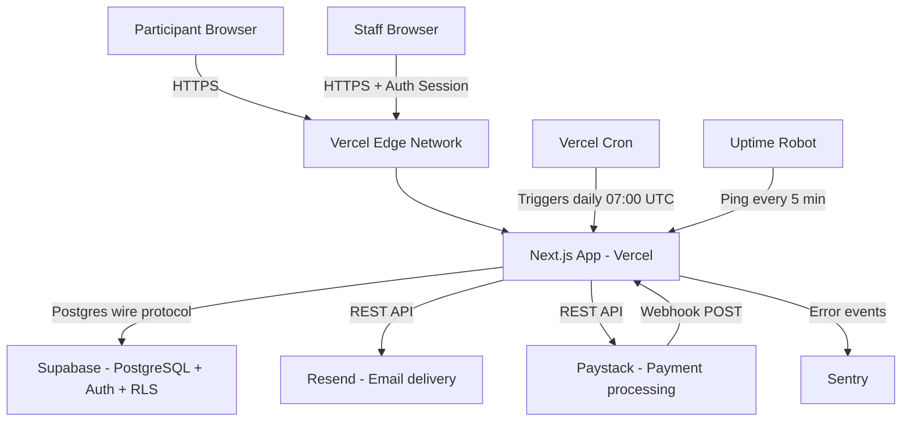
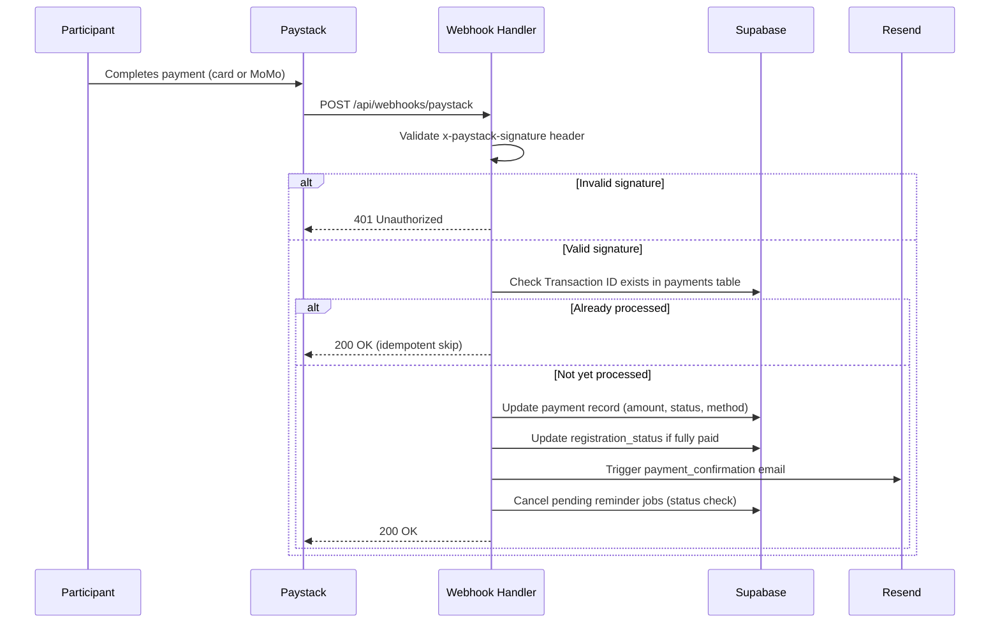
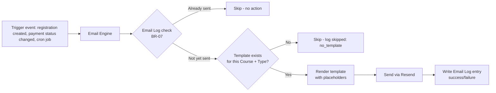
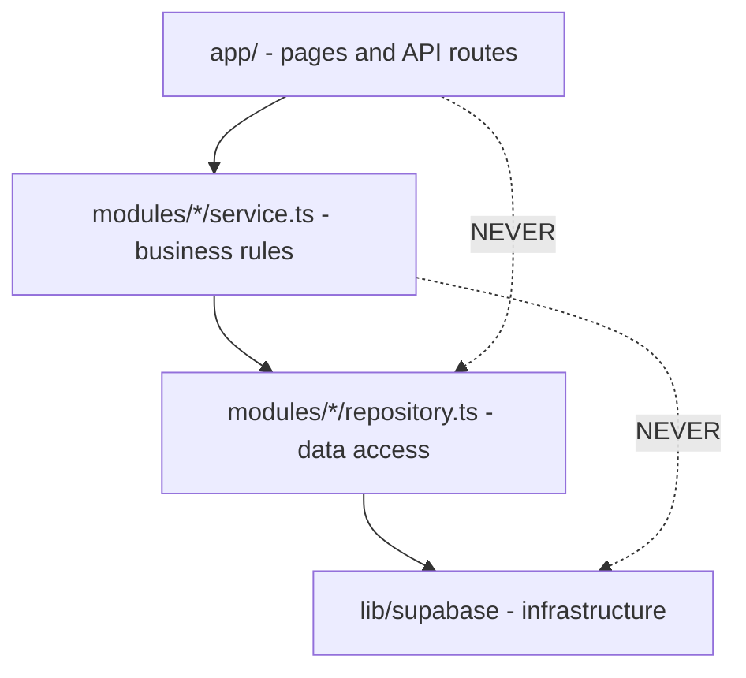

# Centralised Course Registration & Follow-Up System
## Technical Architecture Document

---

| Field | Value |
|---|---|
| **Document** | Technical Architecture Document |
| **Version** | 1.0 |
| **Date** | June 2026 |
| **Status** | Approved for Development |
| **Audience** | AI Coding Agent |
| **Input from** | Document 1: Product Requirements Document |

---

## Changelog

| Version | Date | Change |
|---|---|---|
| 1.0 | June 2026 | Initial document |

---

## Table of Contents

1. [Architecture Pattern](#1-architecture-pattern)
2. [Confirmed Stack](#2-confirmed-stack)
3. [Repository Structure](#3-repository-structure)
4. [Module Boundaries](#4-module-boundaries)
5. [Deployment Architecture](#5-deployment-architecture)
6. [API Surface Map](#6-api-surface-map)
7. [Scheduled Jobs Architecture](#7-scheduled-jobs-architecture)
8. [Paystack Webhook Flow](#8-paystack-webhook-flow)
9. [Email Engine Architecture](#9-email-engine-architecture)
10. [Environment Variable Manifest](#10-environment-variable-manifest)
11. [Dependency Rule Enforcement](#11-dependency-rule-enforcement)
12. [Ready for Development Checklist](#12-ready-for-development-checklist)

---

## 1. Architecture Pattern

**Pattern: Modular Monolith (FOUNDRY_PATTERNS PAT-003). Confidence: High.**

A single Next.js application, single deployment on Vercel, single Supabase project. Modules
are separated by folder boundary and by data ownership, not by network boundary. There is no
inter-service HTTP call anywhere in this system (AP-008 — premature microservices avoided).

**Why this pattern, restated from Discovery Stage 4:** Team size is 1 founder directing an AI
coding agent, budget is $0, and volume is 1,440 registrations/year. Distributed systems
complexity (P4.13, P4.14 — partial failure and unreliable networks) would be pure cost with
zero benefit at this scale. Every module lives in one deployable unit.

**Upgrade path (documented, not built now):** If the system ever needs one component to scale
independently — most likely email sending at very high volume — that single module is
extracted using the strangler fig pattern, per PAT-003's known upgrade path. Not required for
Phase 1, 2, or 3 at current or projected volume.

---

## 2. Confirmed Stack

| Layer | Choice | Rationale (from DEC-002 through DEC-011) |
|---|---|---|
| Framework | Next.js 14+ (App Router), TypeScript | Single codebase for UI + API; best AI agent buildability |
| Database | Supabase PostgreSQL | Relational fit for payment/registration data (P4.11); free tier sufficient |
| Auth | Supabase Auth | Included with database; Row Level Security enforces roles |
| Email | Resend | 3,000/month free; simplest API for agent implementation |
| Payments | Paystack (Card + MTN MoMo) | Ghana market coverage; already in use by founder |
| UI components | Shadcn/ui + Tailwind CSS | Copied into repo, no dependency drift; fast agent build |
| Hosting | Vercel | Free tier; native Next.js; automatic HTTPS |
| Scheduled jobs | Vercel Cron | Free on Hobby tier; triggers time-based reminder logic |
| Uptime monitoring | Uptime Robot | Prevents Supabase 7-day inactivity pause |
| Error tracking | Sentry | Free tier; native Next.js SDK |

---

## 3. Repository Structure

```
course-system/
├── app/
│   ├── (public)/
│   │   └── register/
│   │       └── page.tsx                # F1.01 Registration form (public)
│   ├── (staff)/
│   │   ├── dashboard/page.tsx          # F1.08 Management dashboard
│   │   ├── registrations/page.tsx      # F1.03 Registration list
│   │   ├── payments/page.tsx           # F1.04 Payment tracking
│   │   ├── courses/page.tsx            # F1.02 Course control panel
│   │   ├── my-courses/page.tsx         # Tutor view
│   │   ├── follow-up/page.tsx          # F2.07 Phase 2
│   │   ├── users/page.tsx              # Admin: staff account management
│   │   └── layout.tsx                  # Role-aware navigation shell
│   ├── api/
│   │   ├── registrations/route.ts      # POST — create registration
│   │   ├── payments/[id]/route.ts      # PATCH — update payment (Finance)
│   │   ├── webhooks/paystack/route.ts  # POST — F1.05 Paystack webhook
│   │   ├── cron/reminders/route.ts     # GET — triggered by Vercel Cron
│   │   ├── cron/class-reminders/route.ts # Phase 2
│   │   └── participants/[id]/delete/route.ts # DPA-02 deletion
│   ├── login/page.tsx
│   └── layout.tsx
├── modules/
│   ├── registrations/
│   │   ├── repository.ts               # DB queries only (PAT-005)
│   │   ├── service.ts                   # Business rules (BR-01 to BR-03, BR-19)
│   │   └── types.ts
│   ├── courses/
│   │   ├── repository.ts
│   │   ├── service.ts
│   │   └── types.ts
│   ├── payments/
│   │   ├── repository.ts
│   │   ├── service.ts                   # BR-04 to BR-06, BR-12
│   │   ├── paystack-webhook-handler.ts   # BR-13, BR-14
│   │   └── types.ts
│   ├── communications/
│   │   ├── repository.ts
│   │   ├── email-engine.ts              # F1.06 template rendering + send
│   │   ├── reminder-scheduler.ts        # BR-07, BR-08, BR-17
│   │   └── types.ts
│   ├── users/
│   │   ├── repository.ts
│   │   ├── service.ts
│   │   └── types.ts
│   └── dashboard/
│       └── repository.ts                # Read-only aggregations (F1.08)
├── lib/
│   ├── supabase/
│   │   ├── client.ts                    # Browser client
│   │   ├── server.ts                    # Server client (service role, cron/webhooks only)
│   │   └── middleware.ts                # Session refresh
│   ├── paystack/
│   │   └── client.ts                    # Signature verification, API calls
│   ├── resend/
│   │   └── client.ts
│   └── auth/
│       └── roles.ts                      # Role constants, permission helpers
├── components/
│   └── ui/                               # Shadcn components
├── supabase/
│   └── migrations/                       # SQL migration files (Document 3)
├── middleware.ts                         # Route protection by role
├── .env.local.example
└── package.json
```

**Rule enforced:** Nothing inside `app/` contains business logic directly. Pages and API
routes call `modules/*/service.ts` functions. Service functions call `modules/*/repository.ts`
functions for all database access. No `supabase.from(...)` calls exist outside repository
files (PAT-005 — Repository Pattern).

---

## 4. Module Boundaries

Per P17.02 (bounded contexts) and P7.05 (data ownership is the most important service
boundary), each module owns specific tables and exposes only its service-layer functions to
the rest of the application.

| Module | Owns tables | Exposes to other modules |
|---|---|---|
| `registrations` | `participants`, `registrations` | `createRegistration()`, `getRegistrationById()`, `checkDuplicate()` |
| `courses` | `courses`, `batches` | `getActiveBatches()`, `getBatchById()`, `getCourseSettings()` |
| `payments` | `payments` | `updatePaymentStatus()`, `markAsPaid()`, `processWebhookEvent()` |
| `communications` | `email_log`, `email_templates` | `sendEmail()`, `hasEmailBeenSent()`, `renderTemplate()` |
| `users` | `staff_users` | `getCurrentUserRole()`, `getUserById()` |
| `dashboard` | *(reads only, owns nothing)* | `getDashboardSummary()` |

**Cross-module rule:** The `payments` module calling `communications.sendEmail()` after a
status change is the only permitted direct cross-module call pattern (a deep, function-level
call — not a network call, since this is a monolith). No module queries another module's
tables directly. If `dashboard` needs payment data, it calls `payments`'s exposed read
functions, never `supabase.from('payments')` directly.

---

## 5. Deployment Architecture



**Single environment for Phase 1.** No separate staging environment is provisioned given the
$0 budget — Vercel Preview Deployments (free, automatic on every git branch) serve as the
staging equivalent. Production deploys only from the `main` branch.

---

## 6. API Surface Map

High-level map only. Full request/response contracts are in Document 5 (API Contract).

| Route | Method | Auth required | Module | Maps to |
|---|---|---|---|---|
| `/api/registrations` | POST | None (public) | registrations | F1.01 |
| `/api/registrations/[id]` | GET | Staff (role-filtered) | registrations | F1.03 |
| `/api/courses` | GET, POST | Staff (admin write) | courses | F1.02 |
| `/api/batches` | GET, POST, PATCH | Staff (admin write) | courses | F1.02 |
| `/api/payments/[id]` | PATCH | Staff (finance only) | payments | F1.04 |
| `/api/webhooks/paystack` | POST | Paystack signature | payments | F1.05 |
| `/api/cron/reminders` | GET | Vercel Cron secret | communications | F1.07 (E03–E06) |
| `/api/participants/[id]/delete` | POST | Staff (admin only) | registrations | DPA-02 |
| `/api/dashboard/summary` | GET | Staff (admin, management) | dashboard | F1.08 |
| `/api/users` | GET, POST, PATCH | Staff (admin only) | users | US-A05 |

---

## 7. Scheduled Jobs Architecture

**Trigger mechanism:** Vercel Cron (free on all plans, including Hobby).

```json
// vercel.json
{
  "crons": [
    { "path": "/api/cron/reminders", "schedule": "0 7 * * *" }
  ]
}
```

**`0 7 * * *`** = every day at 07:00 UTC, which is 07:00 Ghana time (Ghana is UTC+0, per
PRD Section 16 assumption).

**Job logic (`/api/cron/reminders/route.ts`):**

1. Authenticate the request using the `CRON_SECRET` header (Vercel automatically attaches
   this; the route rejects any request without a matching secret).
2. Query all Registrations where Payment Status IN (Unpaid, Part Payment) AND the Batch is
   Active.
3. For each Registration, evaluate all four reminder conditions (E03–E06) against current
   date and the Batch's Start Date.
4. For each condition met, check the Email Log for deduplication (BR-07) before sending.
5. Log results: emails sent, emails skipped (deduplicated), emails skipped (payment status
   changed since query), errors.
6. Return a summary JSON response for monitoring purposes (visible in Vercel function logs).

**Design note (P10.03 — avoid over-steering):** The job is idempotent by design — running it
twice in the same day produces no duplicate emails, because BR-07's deduplication check runs
independently of the cron schedule. This means a manual re-trigger (for testing or recovery
after a failure) is always safe.

---

## 8. Paystack Webhook Flow



Full implementation detail — including the exact webhook payload shape, GHS/kobo conversion,
and error handling for partial failures — is specified in Document 7 (Integration
Specifications) and Document 5 (API Contract).

---

## 9. Email Engine Architecture



**The Email Engine is a single shared function** (`modules/communications/email-engine.ts`)
called by every module that needs to send an email — `payments` calls it after a status
change, `registrations` calls it after form submission, and the cron job calls it for
time-based reminders. This is the one exception to strict module isolation: `communications`
is a generic subdomain (P17.04) that every other module depends on, which is expected and
correct — it is analogous to a shared utility, not a peer domain module.

---

## 10. Environment Variable Manifest

All values are placeholders. Actual values are set in Vercel project settings, never
committed to the repository.

| Variable | Used by | Sensitive |
|---|---|---|
| `NEXT_PUBLIC_SUPABASE_URL` | Client + server | No |
| `NEXT_PUBLIC_SUPABASE_ANON_KEY` | Client | No (RLS enforced) |
| `SUPABASE_SERVICE_ROLE_KEY` | Server only (cron, webhooks) | **Yes — never expose to client** |
| `PAYSTACK_SECRET_KEY` | Webhook signature validation | **Yes** |
| `PAYSTACK_PUBLIC_KEY` | Client-side Paystack checkout | No |
| `RESEND_API_KEY` | Email sending | **Yes** |
| `RESEND_FROM_EMAIL` | Email sending | No |
| `CRON_SECRET` | Cron route authentication | **Yes** |
| `SENTRY_DSN` | Error tracking | No (public DSN by design) |

---

## 11. Dependency Rule Enforcement

Per P6.01 (the dependency rule) — source code dependencies point inward, toward business
logic, never outward toward infrastructure.



**Enforced by convention and code review, not by tooling in Phase 1** (a lint rule for this
is a Phase 2 nice-to-have, not a Phase 1 blocker). The AI coding agent must self-check every
file against this rule before considering a module complete.

---

## 12. Ready for Development Checklist

```
□ 1. Modular monolith pattern confirmed — no microservices, no separate backend.
□ 2. Repository structure matches Section 3 exactly.
□ 3. Six modules identified with clear data ownership (Section 4).
□ 4. No cross-module direct table access — only exposed service functions.
□ 5. Deployment architecture understood — single Vercel + single Supabase project.
□ 6. API surface map reviewed — full contracts follow in Document 5.
□ 7. Scheduled job (Vercel Cron) configured for 07:00 UTC daily.
□ 8. Paystack webhook flow understood, including idempotency and signature validation.
□ 9. Email engine is a shared service called by all other modules — this is
      the one intentional exception to module isolation.
□ 10. All environment variables identified; sensitive keys never in source code.
□ 11. Dependency rule understood: app → service → repository → infrastructure.
□ 12. Next document to read: Document 3 — Data Schema and ERD.
```

---

*Document 3 of 12: Data Schema and ERD follows.*
*Input to Document 3: This document + Document 1 (PRD Section 5 Entity Map).*
