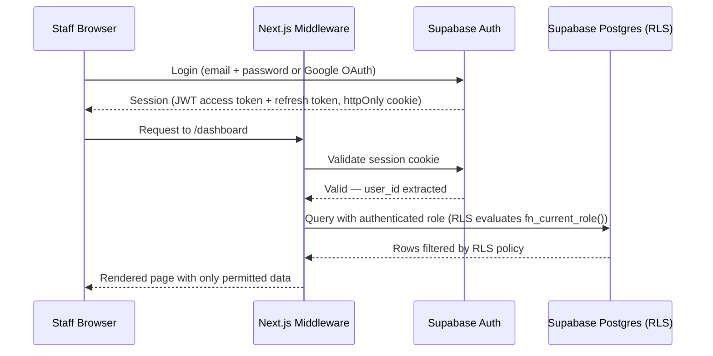

# Centralised Course Registration & Follow-Up System
## Security and Authentication Specification

---

| Field | Value |
|---|---|
| **Document** | Security and Authentication Specification |
| **Version** | 1.0 |
| **Date** | June 2026 |
| **Status** | Approved for Development |
| **Audience** | AI Coding Agent |
| **Input from** | Document 5 (API Contract) |

---

## Changelog

| Version | Date | Change |
|---|---|---|
| 1.0 | June 2026 | Initial specification |

---

## Table of Contents

1. [Authentication Architecture](#1-authentication-architecture)
2. [Token Storage Pattern](#2-token-storage-pattern)
3. [Route Protection](#3-route-protection)
4. [Row Level Security Summary](#4-row-level-security-summary)
5. [Secrets Management](#5-secrets-management)
6. [Webhook Security](#6-webhook-security)
7. [Input Validation Standard](#7-input-validation-standard)
8. [OWASP Checklist Mapping](#8-owasp-checklist-mapping)
9. [Ghana DPA Security Requirements](#9-ghana-dpa-security-requirements)
10. [Incident Response Baseline](#10-incident-response-baseline)
11. [Ready for Development Checklist](#11-ready-for-development-checklist)

---

## 1. Authentication Architecture

**Provider: Supabase Auth. Confidence: High (DEC-005).**

Staff Users authenticate through Supabase Auth using email + password or Google OAuth.
Authentication alone never grants application access: every session must map to an active
`public.staff_users` row with a valid role. There is no self-service application access —
staff profiles are created exclusively by an Admin via `POST /api/users` (Document 5,
Section 11). A Google identity without a linked active staff profile is redirected to the
inactive-account message.

**Hosted Google OAuth configuration:** Google Authorized JavaScript origin
`https://reg.knowsia.com`; Google Authorized redirect URI
`https://nvaqkeffxsuaidkguekz.supabase.co/auth/v1/callback`; Supabase Site URL
`https://reg.knowsia.com`; Supabase Redirect URLs include
`https://reg.knowsia.com/auth/callback`, the production Vercel alias callback, and the
localhost callback used for development. The Google client secret is stored only in the
Supabase Google provider configuration, never in this repository or Vercel.



---

## 2. Token Storage Pattern

**Pattern: httpOnly cookie, managed entirely by Supabase's `@supabase/ssr` package
(PAT-008 adapted for Supabase's native session handling).**

Supabase's Next.js SSR helper library stores the session token in httpOnly cookies by
default — this is the framework's built-in behaviour, not a custom implementation the agent
needs to build. The agent's responsibility is to use `createServerClient` (server-side) and
`createBrowserClient` (client-side) from `@supabase/ssr` exactly as documented, and never to
manually extract or store the JWT in `localStorage` or a JavaScript-accessible variable.

**Explicit prohibition:** No code anywhere in this project may call
`localStorage.setItem` or `sessionStorage.setItem` to store any authentication token,
session data, or user PII. This is a hard rule, not a style preference — `localStorage` is
readable by any injected script (XSS attack surface), and this System handles Ghana DPA-
regulated personal data.

**Session refresh:** Handled by `middleware.ts` calling `supabase.auth.getUser()` on every
request, which silently refreshes the access token using the httpOnly refresh token cookie
when the access token has expired. This is standard Supabase SSR behaviour — no custom
refresh logic required.

---

## 3. Route Protection

```typescript
// middleware.ts
import { createServerClient } from '@supabase/ssr';
import { NextResponse, type NextRequest } from 'next/server';

const ROLE_ROUTES: Record<string, string[]> = {
  '/dashboard': ['admin', 'management'],
  '/registrations': ['admin', 'finance', 'marketing'],
  '/payments': ['admin', 'finance'],
  '/courses': ['admin'],
  '/users': ['admin'],
  '/my-courses': ['tutor'],
  '/follow-up': ['admin', 'marketing'], // Phase 2
};

export async function middleware(request: NextRequest) {
  const { supabase, response } = createSupabaseServerClient(request);
  const { data: { user } } = await supabase.auth.getUser();

  if (!user) {
    return NextResponse.redirect(new URL('/login', request.url));
  }

  const { data: staffUser } = await supabase
    .from('staff_users')
    .select('role, is_active')
    .eq('user_id', user.id)
    .single();

  if (!staffUser?.is_active) {
    return NextResponse.redirect(new URL('/login?error=inactive', request.url));
  }

  const path = request.nextUrl.pathname;
  const requiredRoles = Object.entries(ROLE_ROUTES).find(([route]) => path.startsWith(route))?.[1];

  if (requiredRoles && !requiredRoles.includes(staffUser.role)) {
    return NextResponse.redirect(new URL('/unauthorized', request.url));
  }

  return response;
}

export const config = {
  matcher: ['/dashboard/:path*', '/registrations/:path*', '/payments/:path*',
            '/courses/:path*', '/users/:path*', '/my-courses/:path*', '/follow-up/:path*'],
};
```

⚠️ **This middleware is a UX convenience layer, not the security boundary.** Per P4.02 and
the principle stated in Document 4 (BR-11), the actual security enforcement is Row Level
Security at the database layer (Section 4 below). Middleware route-blocking prevents a
Marketing user from seeing a Payments *page render*, but if that page's API call were
somehow reached directly, RLS is what prevents the data from being returned. Both layers
are implemented; neither is optional.

---

## 4. Row Level Security Summary

Full policies are specified in Document 3, Section 6. This section summarises the security
posture for review purposes.

| Principle | How it's satisfied |
|---|---|
| Least privilege | Every role's RLS policy grants exactly the tables and rows specified in PRD F1.09 — no role has broader access than its function requires |
| Defence in depth | Middleware (route-level) + RLS (row-level) + API route field filtering (column-level, Document 5 Section 3) — three independent layers |
| Fail closed | RLS is enabled (`ENABLE ROW LEVEL SECURITY`) on every table with no default-allow policy; a table with no matching policy for a role returns zero rows, not all rows |
| No privilege escalation via client input | `verified_by`, `payment_status`, and role assignment are never accepted from client request bodies (BR-04, BR-12) |

---

## 5. Secrets Management

All values in Document 2, Section 10 marked "Sensitive: Yes" are stored exclusively as
Vercel Environment Variables, scoped to the Production environment (and a separate set for
Preview, using Supabase's separate free-tier project if a staging Supabase project is later
introduced — not required for Phase 1).

**Rules:**
1. No secret is ever committed to the Git repository, including in `.env` files —
   `.env.local` and `.env` must be in `.gitignore` from the first commit.
2. `.env.local.example` (committed) lists variable names with placeholder values only —
   never real keys.
3. The `SUPABASE_SERVICE_ROLE_KEY` (which bypasses RLS entirely) is used only in
   server-side code that runs in trusted contexts: the cron job route and the webhook
   handler. It is never imported into any file under `app/(public)/` or any client
   component.
4. If a secret is ever accidentally committed, it must be rotated immediately (regenerated
   in Paystack/Resend/Supabase dashboards) — a `git revert` alone does not invalidate an
   already-exposed key.

---

## 6. Webhook Security

Covered in full technical detail in Document 4 (BR-13, BR-14) and Document 5 (Section 7).
Summary for security review:

| Control | Implementation |
|---|---|
| Signature validation | HMAC-SHA512 against raw request body, using `PAYSTACK_SECRET_KEY` |
| Replay protection | `unique(transaction_id)` database constraint — a captured and replayed webhook payload cannot create a second payment record |
| Timing | Webhook handler responds within 5 seconds (NFR, Document 1 Section 15) to avoid Paystack's retry-on-timeout behaviour causing duplicate delivery attempts (which BR-14 handles safely regardless) |
| Unmatched payloads | Logged to Sentry for manual review, never silently dropped (EC-02, Document 4) |

---

## 7. Input Validation Standard

**All validation happens server-side, regardless of client-side validation also being
present** (client-side validation is a UX convenience; it is not trusted).

| Input type | Validation library / method |
|---|---|
| Registration form fields | Zod schema in `modules/registrations/types.ts`, validated in the API route before any database call |
| Payment update fields | Zod schema in `modules/payments/types.ts` |
| Course/Batch fields | Zod schema in `modules/courses/types.ts` |
| Paystack webhook payload | Signature validated first (Section 6); payload shape validated against a Zod schema matching Paystack's documented event structure before any field is read |

**SQL injection:** Not applicable in the traditional sense — Supabase's client library uses
parameterised queries throughout; the agent must not construct any raw SQL string by
concatenating user input, even for the small number of custom RPC functions (Document 3,
Section 4 and 8) — all parameters to those functions are passed as typed function arguments,
never interpolated into a query string.

---

## 8. OWASP Checklist Mapping

| OWASP Top 10 (2021) category | Mitigation in this System |
|---|---|
| A01 Broken Access Control | RLS (Section 4) + middleware (Section 3) + API field filtering (Document 5, Section 3) |
| A02 Cryptographic Failures | HTTPS enforced by Vercel; no card data stored (Paystack handles it); passwords hashed by Supabase Auth (bcrypt), never handled directly by application code |
| A03 Injection | Parameterised queries throughout (Section 7); no raw SQL string concatenation |
| A04 Insecure Design | Full Discovery process (this documentation suite) — role model, business rules, and data model designed before any code was written |
| A05 Security Misconfiguration | Environment variable audit before go-live (Section 5); RLS enabled on every table with no exceptions |
| A06 Vulnerable Components | `npm audit` run before each deployment; dependencies kept current (Document 11, Coding Standards) |
| A07 Identification/Authentication Failures | Supabase Auth handles password hashing, session management, and token refresh — not custom-built |
| A08 Software and Data Integrity Failures | Webhook signature validation (Section 6); no unsigned/unverified external data mutates the database |
| A09 Security Logging and Monitoring Failures | Sentry captures all unhandled errors; `email_log` and `deletion_log` provide audit trails for the two most sensitive operations |
| A10 Server-Side Request Forgery | No user-supplied URLs are fetched server-side in this system (Zoom/WhatsApp links are stored and displayed, never fetched by the server) |

---

## 9. Ghana DPA Security Requirements

Restated from PRD Section 14.1 with the specific technical control for each:

| DPA requirement | Technical control |
|---|---|
| Consent recorded | `registrations.consent_given` + `registrations.registered_at` (timestamp doubles as consent timestamp — no separate `consent_at` needed on registrations since consent and registration happen atomically; `participants.consent_at` tracks first-ever consent for the Participant's overall record) |
| Right to erasure | Soft/hard delete functions (Document 3, Section 8) |
| Data minimisation | Schema (Document 3) contains no fields beyond what Section 14.1 specifies as necessary |
| Security of processing | This entire document |
| Access control | RLS (Section 4) ensures only Admin can view/export a given Participant's full data on request |

---

## 10. Incident Response Baseline

Minimal but explicit, appropriate for a 6-person team with no dedicated security function
(P8.06 — blameless, systemic focus, not punitive).

| Scenario | First response |
|---|---|
| Suspected credential compromise (a staff account) | Admin deactivates the account (`is_active = false` in `staff_users`) immediately via the Users screen — this takes effect on the account's next request since RLS checks `is_active` on every query via `fn_current_role()` |
| Suspected secret leak (API key exposed) | Rotate the specific key in its provider dashboard (Paystack/Resend/Supabase) immediately; update the Vercel environment variable; redeploy |
| Data subject erasure request received | Admin uses the Participant Deletion flow (Document 5, Section 9) within a reasonable timeframe — recommend within 30 days per common DPA practice, to be confirmed with a qualified Ghanaian data protection practitioner (outside Foundry's competence, per the Escalation Rules) |
| Unexpected Sentry error spike | Admin/founder reviews the Sentry dashboard; the error rate is the SLI (P8.02) — no formal SLA exists for this internal tool, but a sustained error rate affecting registration or payment flows is treated as a priority fix |

---

## 11. Ready for Development Checklist

```
□ 1. Supabase Auth confirmed as the sole authentication mechanism — no
      custom password handling anywhere in the codebase.
□ 2. No localStorage or sessionStorage used for any token or session data.
□ 3. Middleware route protection implemented per Section 3 — understood
      as a UX layer, not the security boundary.
□ 4. RLS confirmed enabled on all 8 tables with no default-allow gaps.
□ 5. SUPABASE_SERVICE_ROLE_KEY confirmed used only in cron and webhook
      server-side code, never in client-reachable code paths.
□ 6. .env.local and .env confirmed in .gitignore from the first commit.
□ 7. Webhook signature validation implemented against raw body (Section 6).
□ 8. All input validation implemented server-side via Zod schemas,
      regardless of client-side validation also present.
□ 9. OWASP mapping reviewed — no unmitigated category.
□ 10. Incident response scenarios understood by the Admin/founder before
       go-live (this is operational readiness, not code).
□ 11. Next document to read: Document 7 — Integration Specifications.
```

---

*Document 7 of 12: Integration Specifications follows.*
