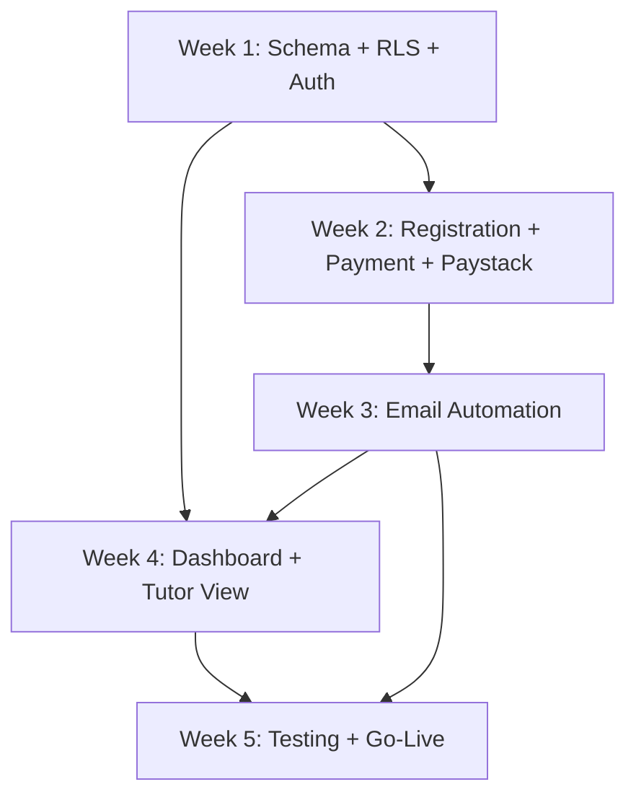

# Centralised Course Registration & Follow-Up System
## Implementation Plan

---

| Field | Value |
|---|---|
| **Document** | Implementation Plan |
| **Version** | 1.0 |
| **Date** | June 2026 |
| **Status** | Approved for Development |
| **Audience** | AI Coding Agent, Founder |
| **Input from** | All previous documents (1–9) |

---

## Changelog

| Version | Date | Change |
|---|---|---|
| 1.0 | June 2026 | Initial 5-week implementation plan |

---

## Table of Contents

1. [Sequencing Principle](#1-sequencing-principle)
2. [Capacity Assumption](#2-capacity-assumption)
3. [Week-by-Week Plan](#3-week-by-week-plan)
4. [Pivot-or-Persevere Gates](#4-pivot-or-persevere-gates)
5. [Dependency Chain](#5-dependency-chain)
6. [Risk Register — Implementation Phase](#6-risk-register--implementation-phase)
7. [Definition of Done — Phase 1](#7-definition-of-done--phase-1)
8. [Ready for Development Checklist](#8-ready-for-development-checklist)

---

## 1. Sequencing Principle

Per PX.10 — sequence work by assumption risk first, then by dependency. The riskiest
assumption in this project is **not** any single feature — it is whether the Paystack
webhook + Resend email + Supabase RLS combination works reliably together in production
conditions. This is tested end-to-end as early as technically possible (Week 2), rather than
left until Week 5, so that any integration surprise has 3 weeks of runway to resolve rather
than 0.

---

## 2. Capacity Assumption

Per URISK-O02 — plans sized at 70% of theoretical capacity, not 100%. The founder is
directing a single AI coding agent, alone, alongside running an active training business.
The 5-week estimate already reflects this discipline (Document 2, Section 7's range: 4
weeks optimistic, 5 weeks expected, 6 weeks pessimistic) — the plan below targets the
expected case and explicitly reserves Week 5 as buffer rather than assuming Week 4 will be
sufficient.

---

## 3. Week-by-Week Plan

### Week 1 — Foundation (Riskiest assumptions first: auth + RLS + core schema)

| Day | Task | Assumption tested |
|---|---|---|
| 1 | Repository scaffold (Document 2, Section 3); Supabase project created; run full migration (Document 3) | Does the schema deploy cleanly, including triggers and generated columns? |
| 2 | Apply RLS policies and PostgREST grants (Document 3, Sections 6–7); create 1 real Admin account | Do RLS policies actually restrict access as designed? (Run T-RLS-01 through T-RLS-07 today, not Week 5) |
| 3 | Course Control Panel screen (F1.02) — Admin can create a Course and Batch | Foundation for everything downstream |
| 4 | Staff User Management screen (US-A05); create remaining 5 staff accounts | |
| 5 | Middleware route protection (Document 6, Section 3); manual smoke test of login + role routing for all 5 roles | Confirms the access-control foundation before building features on top of it |

**Week 1 gate:** All 6 staff can log in and land on their correct default page. RLS test
cases T-RLS-01 through T-RLS-07 pass.

---

### Week 2 — Registration, Payments, and the Riskiest Integration

| Day | Task | Assumption tested |
|---|---|---|
| 6 | Public Registration Form (F1.01) + `POST /api/registrations` endpoint, including BR-01/02/03 | |
| 7 | Payment Tracking screen (F1.04) + `PATCH /api/payments` — manual bank transfer flow only, no Paystack yet | |
| 8 | **Paystack integration: checkout initiation + webhook handler + signature validation (BR-13)** | This is the single highest-risk integration in the project — tackled now, not deferred |
| 9 | **Live Paystack test-mode payment, end-to-end** (T-INT-01, T-INT-02) | Does the full webhook → payment update → registration confirm chain actually work? |
| 10 | Fix any issues found in Day 9's test; run T-BR14-01 (webhook idempotency) explicitly | |

**Week 2 gate — PIVOT-OR-PERSEVERE CHECKPOINT (Section 4):** A successful live test-mode
Paystack payment updates the Registration correctly. If this does not work by end of Week 2,
see Section 4 for the decision rule.

---

### Week 3 — Email Automation

| Day | Task | Assumption tested |
|---|---|---|
| 11 | Resend integration setup; sending domain DNS verification **(start this by Day 11 at the latest** — Document 7, Section 2.1 flags up to 48 hours propagation delay) | |
| 12 | Email engine (F1.06) — template rendering, `sendEmailOnce` with BR-07 reservation pattern | |
| 13 | Welcome + Payment Instruction + Reminder 1 emails (E01–E03), fired on registration | |
| 14 | Reminder 2, 3, 4 (E04–E06) + Vercel Cron job configuration and scheduling | |
| 15 | Payment Confirmation email (E07) + reminder cancellation logic (BR-08); full T-BR07 and T-BR08 test suite | |

**Week 3 gate:** All 7 Phase 1 email types send correctly with correct placeholder data;
deduplication confirmed under repeated cron execution (T-INT-05).

---

### Week 4 — Dashboard, Compliance, Tutor View

| Day | Task | Assumption tested |
|---|---|---|
| 16 | Management Dashboard (F1.08) + `GET /api/dashboard/summary` | |
| 17 | Registration List screen (F1.03) with role-based field filtering (Document 5, Section 3) | |
| 18 | Ghana DPA features: consent checkbox enforcement (BR-15) + soft/hard delete functions and UI (DPA-02) | |
| 19 | My Courses (Tutor) screen + RLS-backed tutor filtering (BR-11); run T-RLS-01/02 again against the finished UI | |
| 20 | Uptime Robot + Sentry setup (Document 7, Sections 4–5); `/api/health` endpoint | |

**Week 4 gate:** All Phase 1 features (F1.01–F1.10) functionally complete. DPA compliance
features present and tested.

---

### Week 5 — Testing, Fixes, Go-Live (Buffer Week)

| Day | Task |
|---|---|
| 21 | Run full Test Specification (Document 9) — all business rule, integration, and RLS test cases |
| 22 | Load test (Document 9, Section 7); fix any concurrency issues found |
| 23 | Manual pre-launch checklist (Document 9, Section 6) with founder and staff |
| 24 | Bug fixes from Days 21–23; production deployment to Vercel; Paystack webhook URL updated to production domain (Document 7, Section 1.2) |
| 25 | Go-live. Register real Course/Batch (if not already done in Week 1). Monitor Sentry and Uptime Robot closely for the first 48 hours. |

**Week 5 gate:** System is live, processing the approaching course's real registrations.

---

## 4. Pivot-or-Persevere Gates

Per P18.04 — scheduled, evidence-based, not left to drift (P10.04 — ballistic thinking).

| Gate | Trigger evidence | If evidence is negative |
|---|---|---|
| **End of Week 2** | Paystack webhook + payment flow does not work end-to-end after 2 full days of dedicated debugging (Days 9–10) | **Persevere with a workaround:** launch Phase 1 with 100% manual payment verification (Finance marks all payments — card, MoMo, and bank transfer — as Paid manually, using Paystack's dashboard as a reference rather than the webhook). This preserves the 5-week timeline. The Paystack webhook automation becomes a fast-follow fix in Week 6, not a blocker to launch. This is a real trade-off (P7.01) — manual verification adds Finance workload temporarily but does not block go-live for the approaching course. |
| **End of Week 3** | Resend domain verification has not completed (DNS propagation issue or registrar delay) | **Persevere with a workaround:** send Phase 1 launch emails using Resend's default onboarding domain (`onboarding@resend.dev`) temporarily — deliverability is lower but functional — and switch to the verified domain once DNS resolves, with zero code change required (only an environment variable update). |
| **End of Week 4** | DPA compliance features (consent, deletion) are not complete | **Do not launch without these.** This is the one gate where the answer is not a workaround — Ghana DPA compliance is a legal requirement (Document 1, Section 14.1), not an optional feature. If Week 4 is at risk, cut a Should-Have feature (e.g. defer the full Registration List filter set to Phase 2) to protect DPA compliance in Phase 1. |

---

## 5. Dependency Chain



Email automation (Week 3) depends on Payment status changes (Week 2) existing to trigger
confirmation emails — this dependency is why Payments is sequenced before Email Automation,
consistent with PX.10's "dependency order" as the third sequencing criterion after
assumption-risk and constraint.

---

## 6. Risk Register — Implementation Phase

Carried forward from Discovery (Document 1, updated Risk Register) with implementation-
specific status:

| ID | Risk | Status entering implementation | Implementation-phase mitigation |
|---|---|---|---|
| RISK-P01 | Ghana DPA non-compliance | Open | Week 4, Day 18 — dedicated day, not squeezed into another task |
| RISK-P02 | Bank transfer cannot auto-confirm | Accepted (by design) | Manual Finance workflow built Week 2, Day 7 |
| RISK-P05 | 4-week timeline, no buffer | **Resolved** — 5-week plan with Week 5 as explicit buffer, confirmed by founder | Monitor: if Week 1–4 gates slip, Week 5 absorbs the slippage before it threatens go-live |
| RISK-P06 | Cost of delay is high (30 registrations/week manual) | Open, ongoing | This is the argument for launching Phase 1 exactly as scoped — no scope creep permitted (BR-05 in Document 1's risk register: any addition requires removing something else first) |

---

## 7. Definition of Done — Phase 1

Phase 1 is complete when, and only when, all of the following are true simultaneously:

```
□ All 10 Phase 1 features (F1.01–F1.10) implemented and passing their
   respective test cases from Document 9.
□ All 19 business rules (Document 4) verified via their test cases.
□ Ghana DPA consent and deletion features are live, not deferred.
□ The real, approaching course intake is set up in the system with real
   Batch data — not just test data.
□ All 6 staff have working accounts and have completed the manual
   pre-launch checklist (Document 9, Section 6) for their own role.
□ Uptime Robot and Sentry are live and confirmed receiving data.
□ The Paystack webhook is registered against the production domain.
□ Zero open Sentry errors from the load test (Document 9, Section 7).
```

---

## 8. Ready for Development Checklist

```
□ 1. 5-week plan understood: Week 1 Foundation, Week 2 Payments/Paystack
      (highest risk, tackled early), Week 3 Email, Week 4 Dashboard/
      Compliance, Week 5 Testing/Go-Live buffer.
□ 2. Both pivot-or-persevere gates (Paystack, Resend) have a pre-agreed
      workaround — the agent does not need to escalate a delay decision
      mid-build if these specific failure modes occur; the workaround is
      pre-approved by the founder via this document.
□ 3. The DPA compliance gate (Week 4) has NO workaround — this is
      understood as a hard requirement, unlike the two technical gates.
□ 4. Definition of Done (Section 7) is the actual completion bar — not
      "code compiles" or "looks done," but all 8 criteria simultaneously true.
□ 5. Next document to read: Document 11 — Coding Standards and Conventions.
```

---

*Document 11 of 12: Coding Standards and Conventions follows.*
